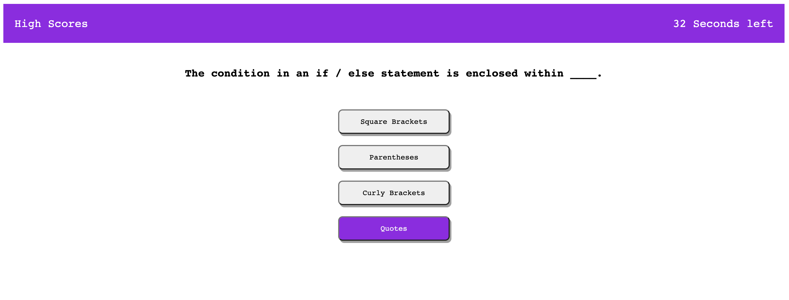

# Code-quiz

## Description

This week's challenge was to build a timed coding quiz with multiple-choice questions. This app runs in the browser and features dynamically updated HTML and CSS powered by JavaScript code. It needs a clean, polished, and responsive user interface.

The main acceptance criteria were as follow:

- A timer starts when I click on start buttonand I am presented with a question
- When I answer a question then I am presented with another question
- When I answer a question incorrectly then time is subtracted from the clock
- When all questions are answered or the timer reaches 0 then the game is over
- When the game is over I can save my initials and my score

## What I learned

Once again during this challenge I learned many important fundamentals of javascript. I used event listeners, timer intervals. I manipulated and traversed the DOM and was able to use the local storage to store and retrieve data.

## Challenges

This was a challenging project and meeting all the requirements took a few hours of hard-work! I struggled to figure out how to properly use the local storage and making sure to hide or display content depending on where the user is within the quiz was a little tricky. I was able to push through by searching documentation and trying a few different ways of getting the expected result.

### Link to deployed page

https://appolinefr.github.io/Code-quiz/

#### Screenshot of deployed page

